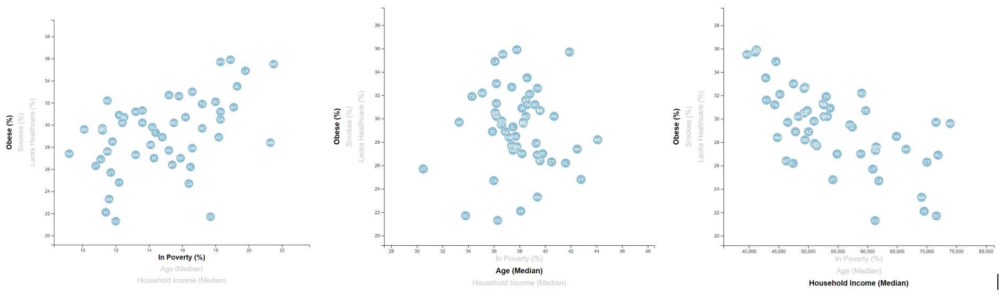
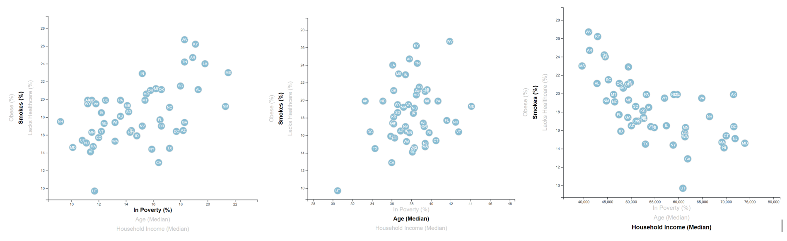
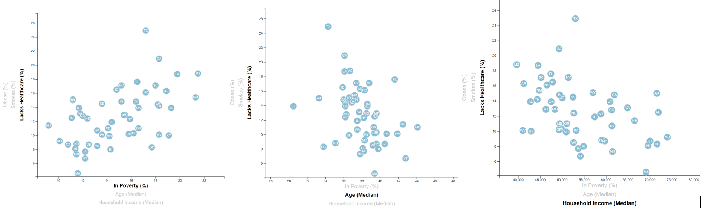

# Data Visualization

This exercise analyzes the current trends that shape people's lives, as well as creating charts, graphs and interactive elements to help the reader understand the findings.

This exercise was carried out with information from the US Census Bureau. The US. And the Behavioral Risk Factor Surveillance System.

The data set is based on 2014 ACS 1-year estimates: https://factfinder.census.gov/faces/nav/jsf/pages/searchresults.xhtml

## Analysis:

### Relationship between Obese (%) and Poverty (%)/ Age (Median)/Household Income (Median):
 

 
The graphs that are related to obesity show us that there is an inverse causality between lower-income and obesity. This could be caused because obesity is considered a cause of low income*. Obese people refer to low-income jobs due to discrimination in the labor market and public stigmatization, causing the person to receive less income and have access to poor quality food. The states with the highest obesity and lowest family income are Arkansas, West Virginia, and Mississippi. While the states with less obesity and are in the group of states with higher incomes are Colorado, Washington D.C. and Hawaii.
It should also be taken into account that the average age at which the highest rates of obesity are found is between 34 and 42 years.
*https://www.ncbi.nlm.nih.gov/pmc/articles/PMC5781054/
 

### Relationship between Smokes (%) and Poverty (%)/ Age (Median)/Household Income (Median):
 

 
The relationship between household income and smoking is also an inverse relationship since as household income increases, tobacco consumption decreases and as household income decreases, tobacco consumption increases. The states with the highest number of smokers and the lowest family income are West Virginia, Kentucky, and Arkansas. On the other hand, it should be noted that the state with the least number of smokers is Utah.
It should also be taken into account that the average age at which the highest rates of smokers are found is between 36 and 42 years.
 

### Relationship between Lacks Healthcare (%) Poverty (%)/ Age (Median)/Household Income (Median):
 

 
According to the data provided and shown in the graphs, it can be inferred that as the level of poverty increases, the lack of attention in health care also increases. While money can only seem important, it may be that poor people have worse health not because they don't have enough money but for some other reason. Similarly, a society characterized by a high degree of income inequality could have poor average health for reasons other than income distribution.
It should also be taken into account that the average age at which the highest rates of lack of healthcare are found is between 32 and 42 years.
 
 
 
